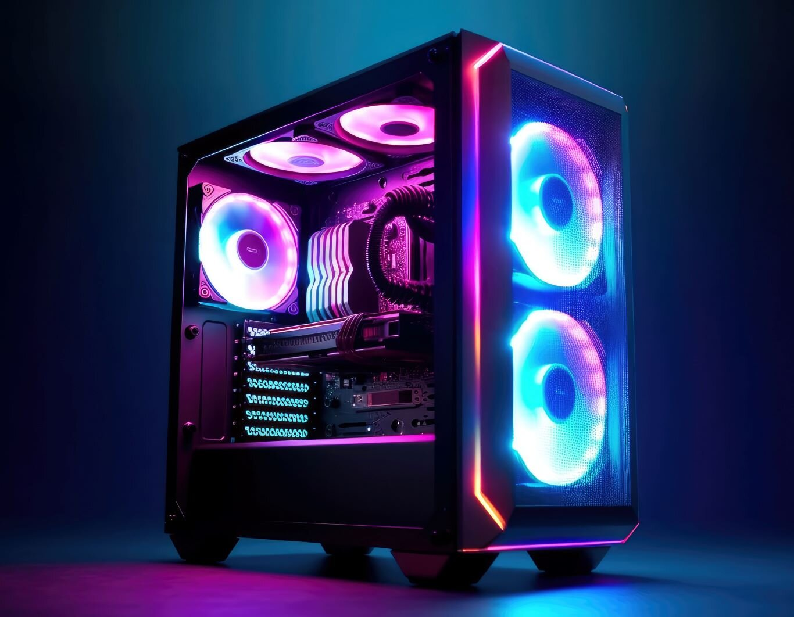
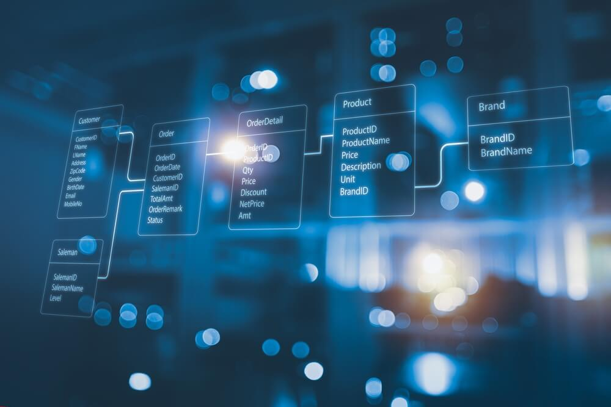
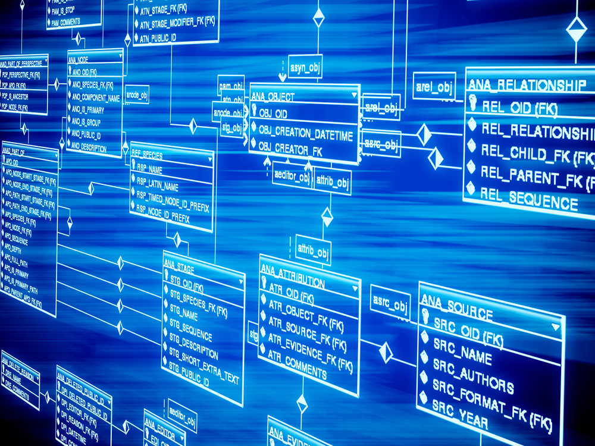

During my studies, I created many repositories with various interesting topics and assignments. I would like them to be available here so that the effort invested can be seen.

  

## Term 1:

### "Introduction to Computer Science"

The subject involved familiarizing with the basics of algorithmics. It covered topics such as loops, arrays including multi-dimensional ones, as well as recursion and linked lists.

Source: <a href="https://github.com/23adrian2300/CPP_projekt-AGH">AGH/IntroductionToComputerScience</a>

  

## Term 2:

### "Data algorithms and structures"

"Data algorithms and structures" built upon the fundamentals learned in the course "Introduction to Computer Science". Topics covered included sorting, dynamic programming, and graphs. This subject was challenging yet very enriching.

Source: <a href="https://github.com/23adrian2300/ASD-AGH">AGH/DataAlgorithmsAndStructures</a>

### "Imperative Programming"

Imperative Programming focused on learning the basics of the C language. It covered data structures, pointers, and file operations.

Source: <a href="https://github.com/23adrian2300/PI-AGH">AGH/ImperativeProgramming</a>

  

## Term 3:

### "Probability and statistics"

The subject covered topics related to statistics and probability. As part of coding assignments, a program in the R language was to be implemented.

Source: <a href="https://github.com/23adrian2300/Statystyka-AGH">AGH/ProbabilityAndStatistics</a>

### "Differential and Difference Equations"

The subject focused on differential and difference equations. As a project, we had to write a program performing calculations and drawing graphs. In my case, the task involved a heat transport equation.

Source: <a href="https://github.com/23adrian2300/RRIR_projekt-AGH">AGH/DifferentialAndDifferenceEquations</a>

### "Introduction to Databases"

Introduction to databases focused on introducing us to the SQL language. Additionally, apart from database queries, we had to complete a project where we modeled the entire database. The repository is a fork since the subject was carried out in groups.

Source: <a href="https://github.com/23adrian2300/BazyDanych">AGH/IntroductionToDatabases</a>

### "Object Oriented Programming"

The subject focused on learning the Java language. Additionally, we began to explore design patterns. During the labs, we developed applications, and later, we worked on a large project.

Source: <a href="https://github.com/23adrian2300/PO_lab-AGH">AGH/ObjectOrientedProgramming</a>

### "Functional programming"

The subject concentrated on learning elements of the Haskell language. During the labs, we learned typical elements for functional programming, e.g., monads.

Source: <a href="https://github.com/23adrian2300/ProgramowanieFunkcyjne-AGH">AGH/FunctionalProgramming</a>

  

## Term 4:

### "Computation Methods for Science and Technology"

The aim of the subject was to introduce basic numerical algorithms, their numerical properties (conditioning, correctness, stability) in connection with the characteristics of computer arithmetic.

Source: <a href="https://github.com/23adrian2300/MOwNiT-AGH">AGH/ComputationMethods ForScienceAndTechnology</a>

### "Operating Systems"

The subject focused on acquainting with the principles of operating systems' functioning and methods of their construction. Laboratories involved completing sets written in the C language.

Source: <a href="https://github.com/23adrian2300/SystemyOperacyjne-AGH">AGH/OperatingSystems</a>

### "Programming in Java Script"

The subject focused on introducing JavaScript, HTML, TypeScript, etc. During the classes, we developed a project intended to be a bank's website.

Source: <a href="https://github.com/23adrian2300/JavaScript-AGH">AGH/ProgrammingInJavaScript</a>

### "C++ programming"

The subject aimed to acquaint with object-oriented tools in the C++ language and the standard C++ library. Additionally, we learned about language dynamics and changes introduced in subsequent standards (C++11, C++17, C++20).

Source: <a href="https://github.com/23adrian2300/CPP-AGH">AGH/CppProgramming</a>

### "Object-oriented design"

The subject focused on introducing commonly used object-oriented programming patterns. Laboratories involved solving and improving ready-made codes.

Source: <a href="https://github.com/23adrian2300/ProjektowanieObiektowe-AGH">AGH/Object-orientedDesign</a>

### "Database"

Database focused on introducing the technology of developing database applications and presenting us with various possible databases, e.g., MongoDB, Entity Framework, etc.

Source: <a href="https://github.com/23adrian2300/BazyDanych_II-AGH">AGH/Database</a>

  

## Term 5:

### "Fundamentals of artificial intelligence"

The subject focused on acquainting us with the basics of artificial intelligence. During the classes, we filled in Jupyter notebooks and created, for example, AI in chess or recommendation systems.

Source: <a href="https://github.com/23adrian2300/PSI-AGH">AGH/FundamentalsOfArtificialIntelligence</a>

### "Computer Networks"

During computer networks, we became familiar with layers 1-4, ending with TCP/UDP. As part of the classes, the task was to create a network model in Cisco.

Source: <a href="https://github.com/23adrian2300/Sieci-AGH">AGH/ComputerNetworks</a>

### "Theory of Concurrency"

The subject focused on introducing us to concurrent programming. We learned about Petri nets and directed graphs. During the labs, there were three homework assignments to complete, which expanded our knowledge.

Source: <a href="https://github.com/23adrian2300/TeoriaWspolbieznosci-AGH">AGH/ComputationAndComplexityTheory</a>

### "Microprocessor Techniques"

During the subject, we learned to program various boards and devices. We worked with Arduino, Raspberry Pi, etc.

Source: <a href="https://github.com/23adrian2300/TechnikiMikroprocesorowe-AGH">AGH/MicroprocessorTechniques</a>

### "Computer graphics"

During computer graphics, we learned to model various things. As part of the course, we had to create a frog in the Maya program.

Source: <a href="https://github.com/23adrian2300/GrafikaKomputerowa-AGH">AGH/ComputerGraphics</a>
