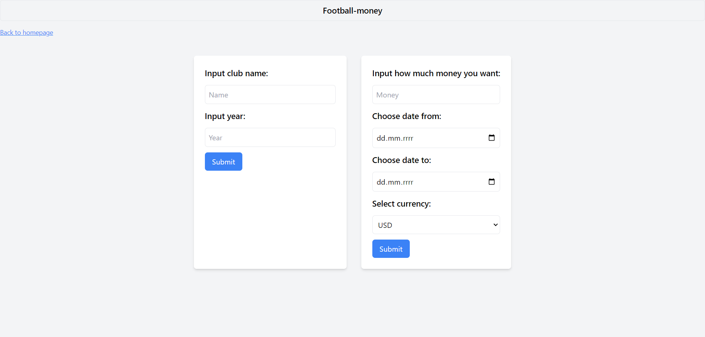

## Description

The aim of the task is to create a simple web service that implements a certain complex functionality based on open services providing REST APIs. Create a service that:

- provides the client with a static HTML page with a form to collect request parameters,
- receives a request from the client,
- queries a public service (various endpoints), preferably several services for the data needed to construct the response,
- processes the received responses (e.g., calculating averages, finding extremes, comparing values from different services, etc.),
- generates and sends a response to the client (static HTML page with results).

Source: <a href="https://github.com/23adrian2300/Football-money">Python/Football-money</a>

## Solution

I utilized the following APIs:

Without API_KEY:
(For finding the most expensive football player)

- https://transfermarkt-api.vercel.app/docs
  (For finding average min, max when converting amount to PLN)

- https://api.nbp.pl/
- https://www.frankfurter.app/docs/

With API_KEY:

(For converting Euro to PLN at player value)

- https://currencyapi.com/
- https://www.exchangerate-api.com/

Therefore, in the .env file, there are API_KEYs for these services.

In my solution, there are two forms, one allowing to search for the most expensive football player in a given team, and the other allowing to convert Euro amount to PLN. I did it this way because I had a problem with the API fetching the player, as it was not working for a certain period. That's why I made the second form, which allows to convert Euro amount to PLN, to have some backup solution.

## App appearance

  

  

.

  

## How to start?

The API_KEYs for these services are in the .env file. Of course, to make the application work properly, you need to add your keys there.
Similarly, you need to provide the api_key for the API itself in main.py. Different keys are in the api_key.txt file. You should use one of them to be able to use the application.

To run:

uvicorn main:app --reload --port 8002

You can change the port number to another.
