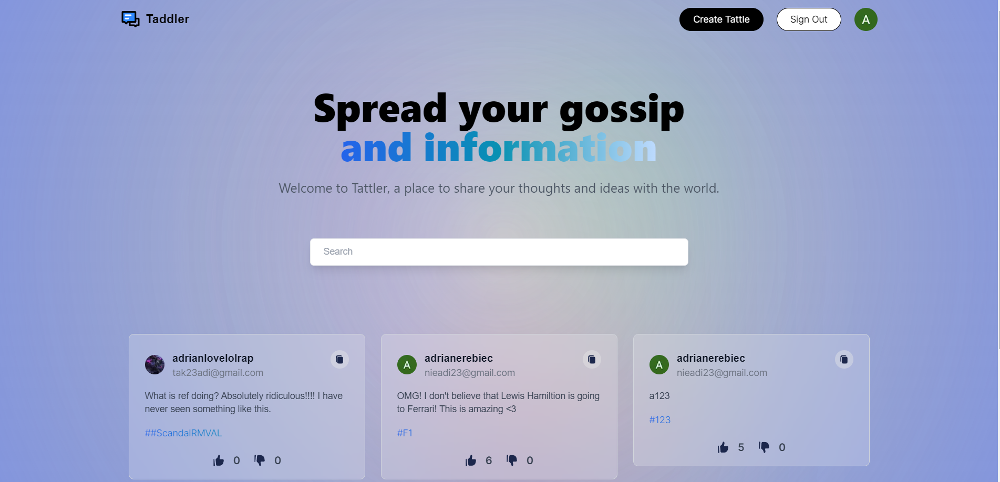

## Description
This is my first application written in Next.js. I was inspired by an excellent tutorial from the 'JavaScript Mastery' channel, which demonstrated the basics of how this framework works very well. I would like to develop and improve the project to make it very user-friendly.

Source: <a href="https://github.com/23adrian2300/NextJS_Project">NextJS/Tattler</a>

## App appearance

  

## How it works?
Tattler is a simple version of Twitter. To build this I am working with MongoDB and Google Cloud. User authentication was build with the Google Cloud. The user is added to the MongoDB database. Their name is automatically created, and the photo is fetched from their Google profile. The user can add new posts, and later edit or delete them. Additionally, there is an option to browse other profiles.

## Plans for the future
Currently, I plan to add the option to rate posts with likes and dislikes. Additionally, I am considering creating chats between users (friends) and later changing the appearance.

