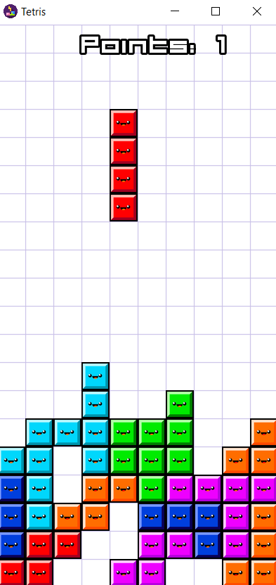

Tetris is a final project for the 'Programming in C++' course. It was written with the help of the SFML library, which enables graphics and game creation. It also allows handling various types of events.

<div class="text-center p-4">
  

</div>


It was also my first major project in C++. However, it wasn't very difficult due to the learning process in previous labs, the solutions of which can be found at the following link:
<a href="https://github.com/23adrian2300/CPP-AGH">weatherApp/weather</a>

An example of event handling code looks like this:

```cpp
#include "game.hpp"

void Game::handleEvents()
{
    float time = clock.getElapsedTime().asSeconds();
    clock.restart();
    timer += time;
    auto event = make_shared<sf::Event>();
    while (window->pollEvent(*event))
    {
        if (event->type == sf::Event::Closed)
        {
            window->close();
        }

        if (event->type == sf::Event::KeyPressed)
        {
            switch (event->key.code)
            {
            case sf::Keyboard::Up:
                change = true;
                break;
            case sf::Keyboard::Right:
                ++directionX;
                break;
            case sf::Keyboard::Left:
                --directionX;
                break;
            default:
                break;
            }
        }
    }

    if (sf::Keyboard::isKeyPressed(sf::Keyboard::Down))
    {
        delay = 0.03;
    }
}
```

Source: <a href="https://github.com/23adrian2300/CPP_projekt-AGH">weatherApp/weather</a>
