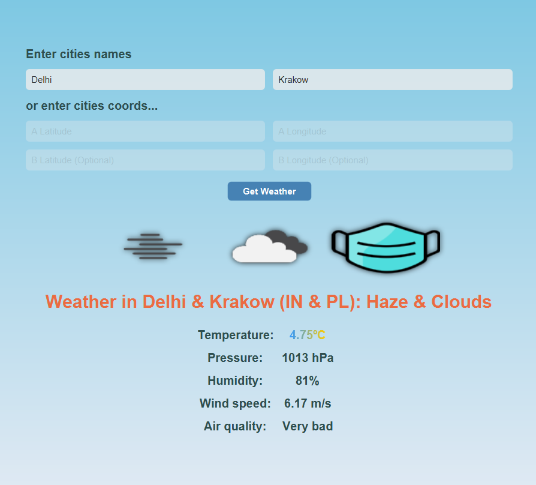

WeatherApp is a Java application that I helped create as a team project during Object-Oriented Technologies, Winter 2023. The project helped me learn how to design and implement java app with API.

WeatherApp is implemented using Java and JavaFX. We also added API (OpenWeatherMap) which allows us to get weather. Within month, we created an application that implements several options to get weather, not only in one town but up to 4.

In this project I gained experience with full-stack java application. I learned how to use API and get data from it. Also I learned how to code unit test to UX and more.

Source: <a href="https://github.com/23adrian2300/AGH-Java-WeatherApp">weatherApp/weather</a>
